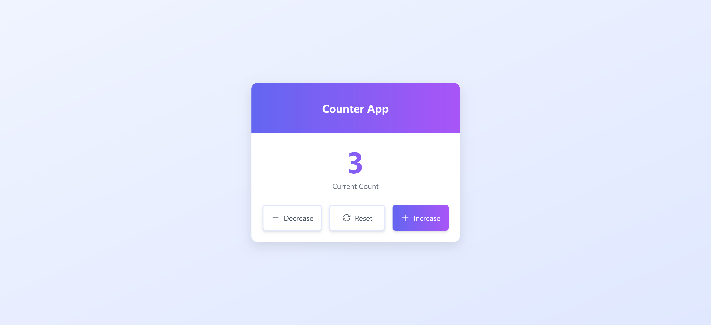

# Simple Counter App

A simple counter application built using HTML, CSS, and JavaScript. The app allows users to increase, decrease, and reset the counter using interactive buttons. It is a simple project, but I wanted to explore a common issue encountered with event delegation when dealing with nested elements, and possible solutions.

## Features

- **Increase Counter**: Increases the counter value by 1.
- **Decrease Counter**: Decreases the counter value by 1.
- **Reset Counter**: Resets the counter value to 0.

## Technologies Used

- **HTML**
- **CSS**
- **JavaScript**

## Setup and Installation

### 1. Clone the repository

```bash
git clone https://github.com/your-username/simple-counter-app.git
```

### 2. Navigate to the project directory

```bash
cd simple-counter-app
```

### 3. Open the `index.html` file in your browser

The app should now be live and functional.

## Example

Here is a preview of the app:



## How It Works

- **Event Delegation** is used to manage button clicks. The `buttons-container` element listens for events on its child elements (buttons) and handles the logic accordingly.
- The counter value is updated in real-time, and the changes are reflected immediately in the DOM.

### Event Delegation

**Core Concept:**

- **Event Bubbling:**
  - JavaScript events have a propagation phase called "bubbling." This means that when an event occurs on an element, it "bubbles up" through its ancestor elements in the DOM tree.
- **Delegation:**
  - Instead of attaching individual event listeners to each child element, you attach one listener to a common parent element.
  - When an event occurs on a child, it bubbles up to the parent, and the parent's event listener handles it.
  - Inside the event listener, you use the `event.target` property to determine which child element actually triggered the event.

**Benefits:**

- **Improved Performance:**
  - Reduces the number of event listeners, which saves memory and improves performance, especially when dealing with a large number of elements.
- **Simplified Code:**
  - Makes code cleaner and more maintainable because you only need to manage one event listener.

### The Issue

The buttons have a span element and svg inside. The `event.target` property points to the most deeply nested element that was clicked. With the code as is, the `event.target` will be the `span` or `svg` when the button is clicked while hovering over those parts of the button, and the intended button action will not work.

```js
 buttonContainer.addEventListener('click', (event) => {
    const target = event.target as HTMLElement;
    const action = target.dataset.action;

    if (action) {
      switch (action) {
        case 'decrease':
          updateCount(count - 1);
          break;
        case 'increase':
          updateCount(count + 1);
          break;
        case 'reset':
          updateCount(0);
          break;
        default:
          break;
      }
    }
  });
```

### Solution

In event delegation, the `event.target` will be the element that was clicked, and if we are clicking on a child of the button (like a `span` or an `svg`), we'll need to ensure that the `data-action` is correctly read from the `button` element and not the child element.

One way to achieve this is by using **`event.target.closest('button')`**. This finds the closest button ancestor of the clicked target (which could be a child element like `span` or `svg`). This way, even if we click on a child of the button, we'll still be able to access the `button` element itself.

```js
buttonsContainer.addEventListener('click', (event) => {
  const target = event.target;

  // Ensure the target is a button
  const button = target.closest('button'); // This will get the nearest button ancestor

  if (button) {
    const action = button.dataset.action; // Get the data-action from the button element

    if (action) {
      switch (action) {
        case 'decrease':
          updateCount(count - 1);
          break;
        case 'increase':
          updateCount(count + 1);
          break;
        case 'reset':
          updateCount(0);
          break;
        default:
          break;
      }
    }
  }
});
```

Another solution is to traverse up the DOM tree from the `event.target` until we find the button element that has the `data-action` attribute.

```javascript
buttonsContainer.addEventListener('click', (event) => {
  let target = event.target;

  while (target && target !== buttonContainer) {
    const action = target.dataset.action;

    if (action) {
      switch (action) {
        case 'decrease':
          updateCount(count - 1);
          break;
        case 'increase':
          updateCount(count + 1);
          break;
        case 'reset':
          updateCount(0);
          break;
        default:
          break;
      }

      return; // Stop traversing once the action is found
    }

    // If the current `target` doesn't have the `data-action`, we move up to its parent element.
    target = target.parentElement;
  }
});
```

Or, If we know that all elements with a `data-action` attribute are `button` elements, we can check the tag name.

```js
buttonsContainer.addEventListener('click', (event) => {
  let target = event.target;

  while (target && target !== buttonContainer) {
    // Checking target tag name
    if (target.tagName === 'BUTTON' && target.dataset.action) {
      const action = target.dataset.action;

      switch (action) {
        case 'decrease':
          updateCount(count - 1);
          break;
        case 'increase':
          updateCount(count + 1);
          break;
        case 'reset':
          updateCount(0);
          break;
        default:
          break;
      }

      return;
    }

    target = target.parentElement;
  }
});
```
